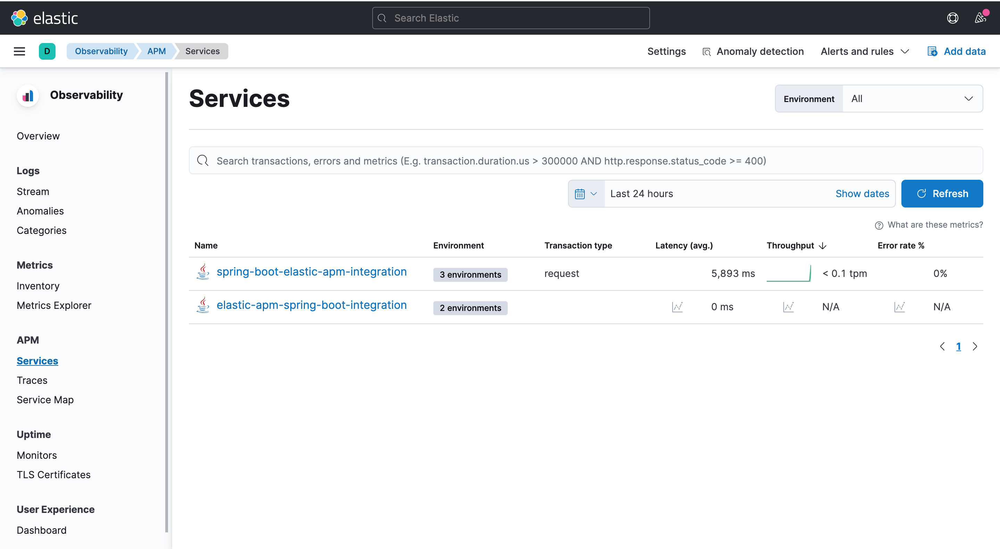
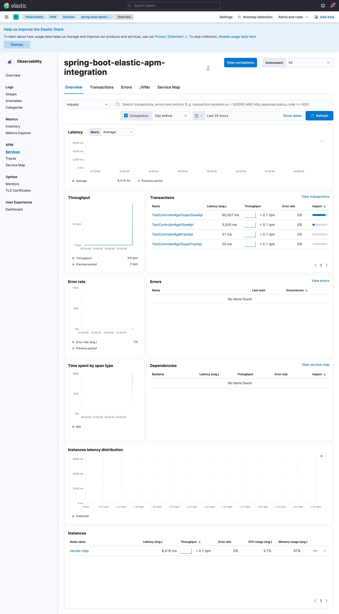
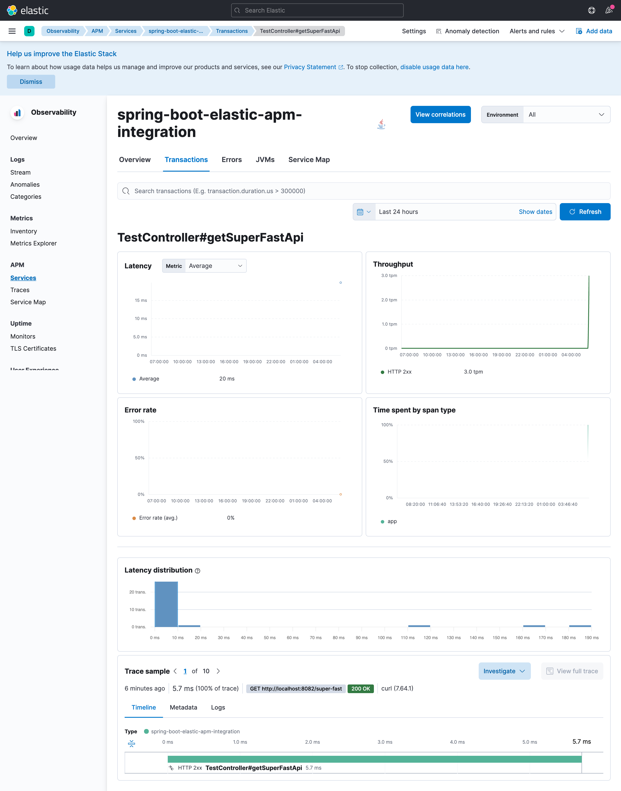
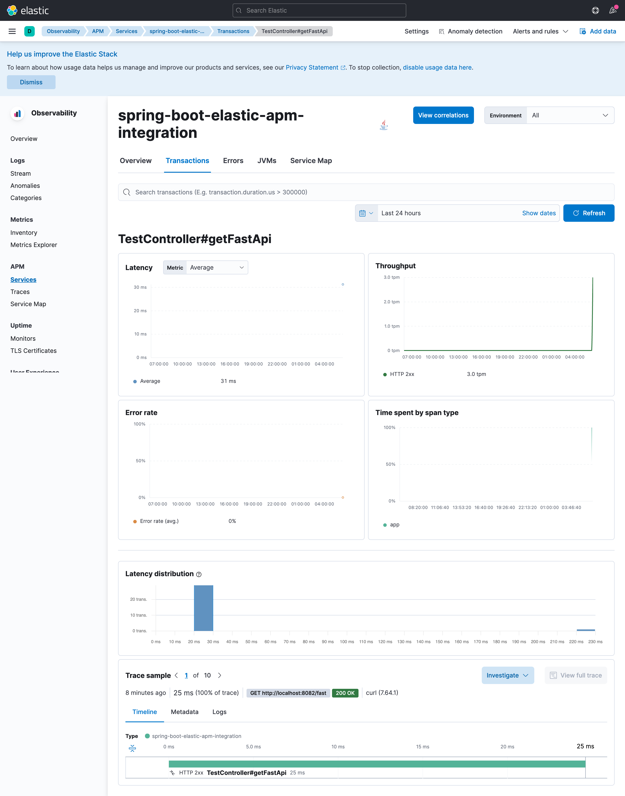
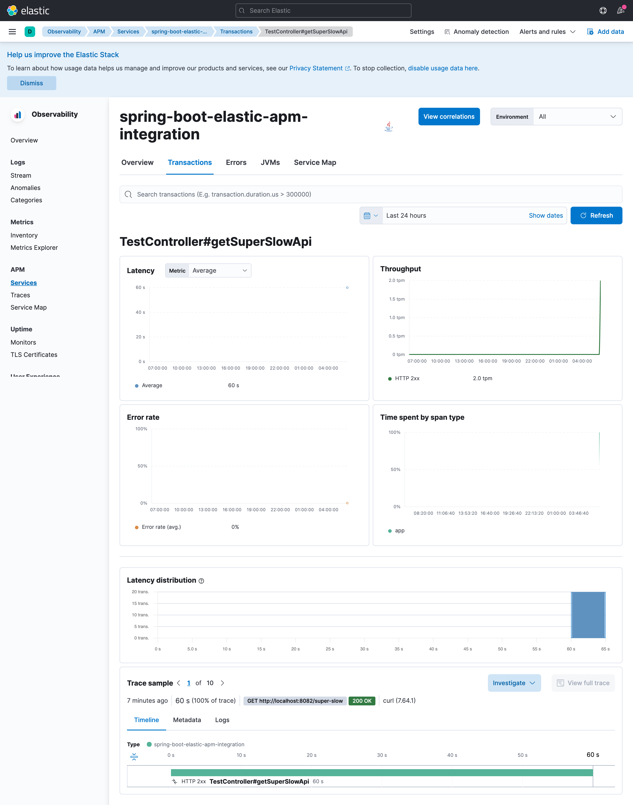
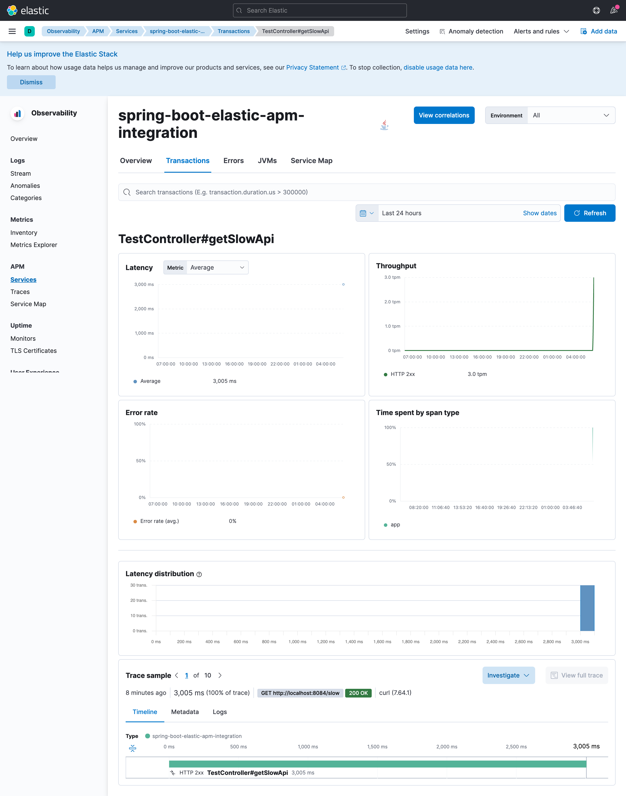

# spring-boot-elastic-apm-integration

### Things todo list:

1. Clone this repository: `https://github.com/hendisantika/spring-boot-elastic-apm-integration.git`
2. Navigate to the folder: `cd spring-boot-elastic-apm-integration`
3. Start the Elasticsearch, Kibana, and Elastic APM servers [terminal 1]: `docker compose up`
4. Start the predev environment [terminal 2]: `mvn spring-boot:run -Dspring-boot.run.profiles=predev`
5. Start the dev environment [terminal 3]: `mvn spring-boot:run -Dspring-boot.run.profiles=dev`
6. Start the staging environment [terminal 4]: `mvn spring-boot:run -Dspring-boot.run.profiles=staging`
7. Start the prod environment [terminal 5]: `mvn spring-boot:run -Dspring-boot.run.profiles=prod`
8. Open Kibana Dashboard: http://localhost:5601/app/apm/services?rangeFrom=now-15m&rangeTo=now
9. Generate some traffic on the different environments using the test-apis.sh script. The script will call each endpoint
   defined in the TestController (/super-fast, /fast, /slow, and /super-slow ) ten times in each environment. Notice
   that the prod environment does not expose the /super-slow endpoint. This is meant to simulate a scenario where a new
   feature is being tested and is not yet deployed to production. `chmod +x test-apis.sh && ./test-apis.sh`

### Images Screen shot

Elastic APM Server Dashboard

Super Fast API Details

Fast API Details

Super Slow API Details

Slow API Details

Article Source: https://levelup.gitconnected.com/how-to-integrate-elastic-apm-java-agent-with-spring-boot-7ce8388a206e
